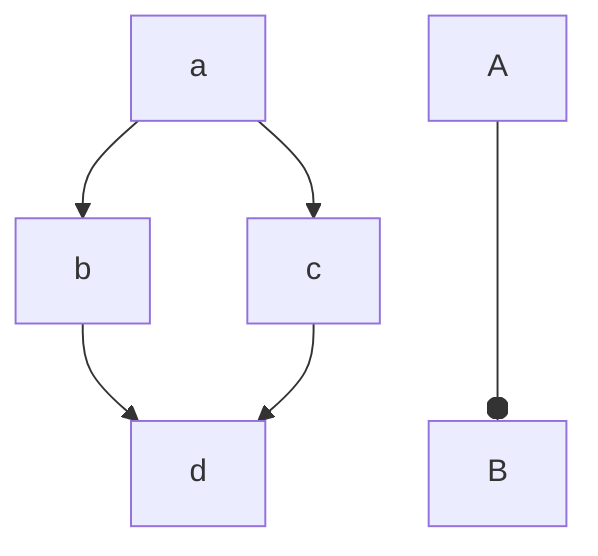
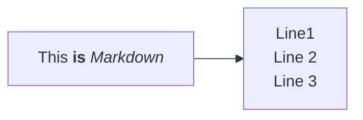
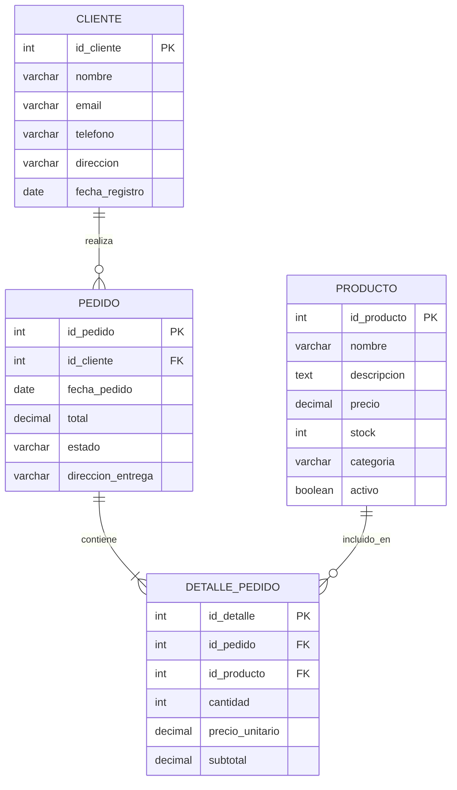
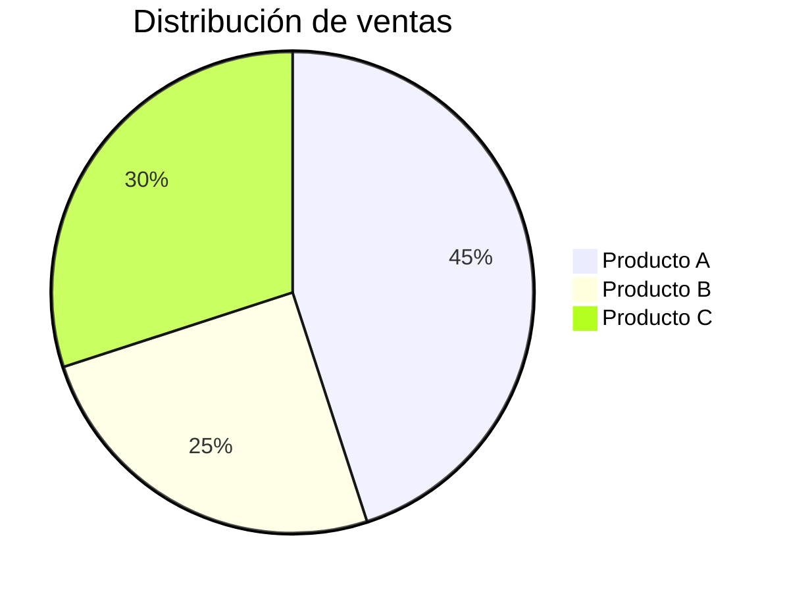
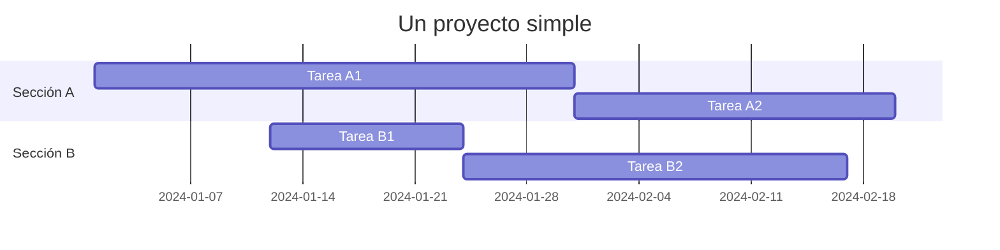
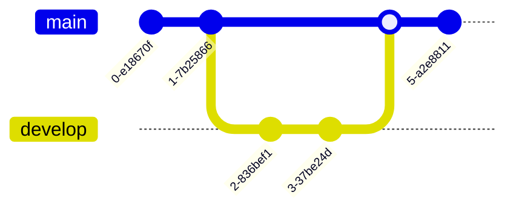

>[!note] 
> Es de código abierto y viene x default en: Obsidian, GitHub, GitLab

Mermaid es una herramienta de diagramación basada en JavaScript que permite crear diagramas y visualizaciones utilizando texto y código. Es una librería que convierte texto en diagramas. En lugar de dibujar diagramas con un editor gráfico, escribes una descripción textual del diagrama y Mermaid lo renderiza en una imagen.

## donde usar mermaid

* Obsidian
* El código fuente está disponible en GitHub (`mermaid-js/mermaid`)*
* En su editor en línea: **Mermaid Live Editor**
* **GitHub, GitLab,**

## Tipos de diagramas que puedes crear con Mermaid

1. **Diagramas de flujo (Flow charts)**: Para representar procesos o algoritmos.
2. **Diagramas de secuencia (Sequence diagrams)**: Para interacciones entre componentes en un sistema.
3. **Diagramas de clase (Class diagrams)**: Para modelar clases y sus relaciones en programación orientada a objetos.
4. **Diagramas de estado (State diagrams)**: Para representar estados y transiciones.
5. **Diagramas de entidad-relación (ER diagrams)**: Para modelar bases de datos.
6. **Diagramas de Gantt (Gantt charts)**: Para planificación de proyectos.
7. **Diagramas de pie (Pie charts)**: Para representar proporciones.
8. **Diagramas de cuadro de líneas (Line charts)**: Para series de datos.
9. **Diagramas de Git graph**: Para visualizar ramas y commits en Git.


* crear nueva nota
* crear diagrama en mermaid.
* [sintaxis](https://mermaid.js.org/syntax/flowchart.html)



Ejemplo


## Ejemplo

Solicitando en una IA (Deep Seek)
```text
dame un diagrama entidad relacion para una base de datos de clientes , productos, pedidos en mermaid
```

Resultado:



## diagramas de pastel



## Diagramas de gantt



## Graficas de git




## alguna sintaxis útil

```text
A --> B          # Flecha sólida
A -.-> B         # Flecha punteada
A ==> B          # Flecha gruesa
A -- Texto --> B # Con texto
```

## Ligas

[Mermaid live](https://mermaid.live/)
