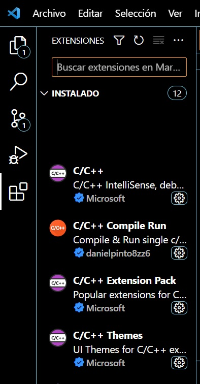

# Lenguaje c/c++

**Nota:** Este es un archivo .md (Mark Down), lo puede abrir y editar desde cualquier editor de texto, pero para ver las características de marcado de texto que realmete tiene, lo puede visualizar corractamente en VSCode abriendolo y dando clic en el icono de "un libro con una lupa" en la parte superio derecha de la ventana del archivo .md.

## caracteres mas usados en c:
| (alt+124)

\ (alt+92)

~ (alt+126)

` (alt+96)

^ (alt+94)

|| 

&&

## comandos importantes en vscode

^d duplica cursor buscando palabras iguales

alt+clic duplica cursor donde se hace clic

f11 alternar pantalla completa

shift+alt [flecha arriba/flecha abajo] duplica linea

alt [flecha arrba/abajo] mueve linea arriba o abajo

^} comenta región

^' outdente (quita identación)

^l marca toda la linea

^a marca todo el documento

^[+/-] zoom

## Compilar c++ en vscode con gcc

Para compilar programas en c/c++ en windows, tiene varias opciones, aquí trabajaremmos con el compilador **gcc** y el editor **Visual Studio Code**.

## Instalar gcc

Para instalar el compilador gcc le muestro 3 opciones:

### Opción 1 gcc con tdm
En la liga:

[descargar tdm gcc](https://jmeubank.github.io/tdm-gcc/)

Esta mplementación de gcc, ** configura el path del sistema ** para acceder al compilador.

### Opción 2 gcc con Dev c++
Dev C++ no es un cimpilador es un ambiente que usa como  compilador gcc.

[Liga para descargar Dev C++ 5.11](https://sourceforge.net/projects/orwelldevcpp/)

Si ya istalo Dev-Cpp en una de las carpetas de la instalacion debe tener la carpta: MingW64 `C:\Program Files (x86)\Dev-Cpp\MinGW64`, como la instalación de **dev cpp** no agrega la ruta del compilador al path, usted deberá agregarla al path.

### Opción 3 gcc desde MySys

MSYS2 es una colección de herramientas y bibliotecas que le brindan un entorno fácil de usar para crear, instalar y ejecutar software nativo de Windows, usando herramientas de Linux.

Mingw-w64 es una rama proyecto avanzado de **mingw.org**, creado para admitir el compilador GCC en sistemas Windows. La rama bifurcó en 2007 para brindar soporte para 64 bits y nuevas API. Desde entonces ha ganado en uso y distribución generalizados.

[liga que explica como instalar mingw en mysys2](https://parzibyte.me/blog/2021/08/23/instalar-gcc-msys2-compilador-c-cpp/)

### Finalmente

Puede instalar Mingw:
1 de forma independiente 
1 o con Dev-Cpp 
3 o (como en mi caso) agregarlo a la instalción de MSYS

Como yo use la última opción, el compilador de C++ esta en la carpeta `C:\msys64\mingw64`,  

Cualquier camino que haya tomado tendra una carpeta `mingw64`.

## Trabajar con cpp en Vscode
VSCODE es un editor libre de Microsoft que puede trabajar con varios lenguajes, a continuación lo configuramos para usar c++.

### Forma 1 VsCode con tdm gcc 
Pasos

* Instalar VSCode desde [Descargar VSCode](https://code.visualstudio.com/download)
* Instalar GCC desde TDM  (se mencionó arriba)
* Agregar las extenciones que se muestran en la figura 'ext-cpp-jpg':


* Listo

Para ejecutar programas haga clic en el icono "play" (|>) en la esquina superior derecha o presione tecla f6.

## Forma 2 Trabajar VsCode con dev-cpp o MSys2
Pasos
* Instalar VSCode desde [Descargar VSCode](https://code.visualstudio.com/download)
* Instalar GCC con Dev-cpp o con mysys64
* Instalar en el path del sistema la ruta de gcc, en mi caso:

`C:\msys64\mingw64\bin`

* En la terminal de vscode, para compilar su  programa, poner el comando:

`gcc -Wall uno.cpp -o uno`

* Para ejecutarjecutar:

`./uno`

## Forma 3 crear tarea en Vscode

En el siguiente ejemplo usaremos el gcc que instalo dev-cpp en :`C:\Program Files (x86)\Dev-Cpp\MinGW64\bin`
* en el menú terminal de vscode de clic en confifurar tareas
* ahi elija CMake:compilacion y eso crea la plantilla de compilacion
* modifique la plantilla debe verse así:

```js
{
	"version": "2.0.0",
	"tasks": [
		{
			"type": "cppbuild",
			"label": "C/C++: gcc.exe compilar archivo activo",
		
			"command": "C:\\Program Files (x86)\\Dev-Cpp\\MinGW64\\bin\\gcc.exe",
			"args": [
				"-Wall",
				"-g",
				"${file}",
				"-o",
				"${fileDirname}\\${fileBasenameNoExtension}.exe"
			],
			"options": {
				"cwd": "${fileDirname}"
			},
			"problemMatcher": [
				"$gcc"
			],
			"group": "build",
			"detail": "mi compilador de : gcc.exe"
		}
	]
}
```
Guarde el archivo.

Para ejecutar el comando, vaya a la ventana de edicion de su programa, en la iterminal de clc en la opcion: ejecutar tarea y elija la que acaba de crear.


## Referencias
[mysys](https://www.msys2.org/)

[instalar mysys](https://parzibyte.me/blog/2021/08/23/instalar-gcc-msys2-compilador-c-cpp/)

[una instroduccion a gcc](https://www.davidam.com/docu/gccintro.es.html)