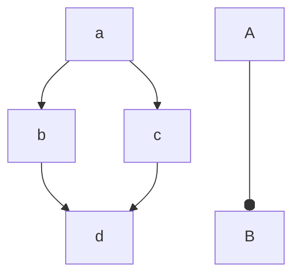
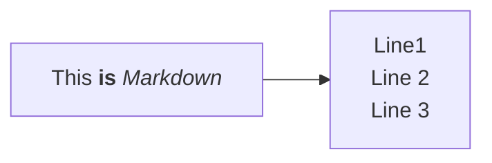

viene x default en Obsidian

* crear nueva nota
* crear diagrama con 3 backtics con la palabra mermaid.
* [sintaxis](https://mermaid.js.org/syntax/flowchart.html)

```mermaid
graph TD;
a-->b;
a-->c;
b-->d;
c-->d;
A---oB;
```

Ejemplo

```mermaid
---
config:
  flowchart:
    htmlLabels: false
---
flowchart LR
    markdown["`This **is** _Markdown_`"]
    newLines["`Line1
    Line 2
    Line 3`"]
    markdown --> newLines

```
