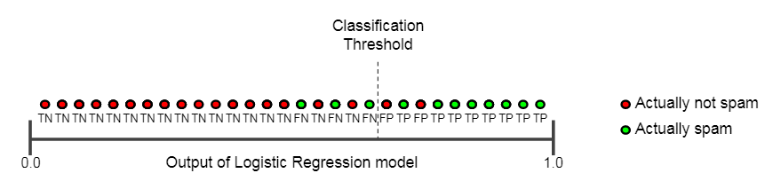
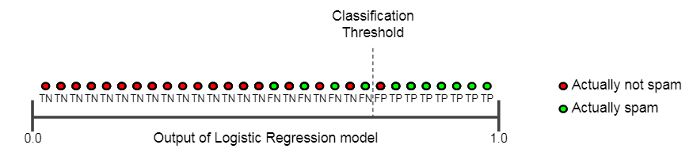

## Clasificación

La regresión logística devuelve una probabilidad. Puede usar la probabilidad devuelta \"tal cual\" (por ejemplo, la probabilidad de que el usuario haga clic en este anuncio es 0.00023) o convertir la probabilidad devuelta a un valor binario (por ejemplo, este correo electrónico es spam).

### Clasificación: Verdadero vs. Falso y Positivo o Negativo

En esta sección, definiremos los bloques de construcción principales de las métricas que usaremos para evaluar los modelos de clasificación.

Pero primero, una fábula de Esopo: El niño que lloró por el lobo

Un pastor se aburre cuidando el rebaño del pueblo. Para divertirse, grita: \"¡Lobo!\" a pesar de que no hay ningún lobo a la vista. Los aldeanos corren para proteger al rebaño, pero luego se enojan mucho cuando se dan cuenta de que el niño les estaba jugando una broma.

Una noche, el pastorcillo ve a un lobo real acercarse al rebaño y grita: \"¡Lobo!\" Los aldeanos se niegan a ser engañados nuevamente y se quedan en sus casas. El lobo hambriento convierte el rebaño en chuletas de cordero. El pueblo pasa hambre. El pánico se produce.

Hagamos las siguientes definiciones:

- **"Wolf"** es una clase positiva.
- **"No wolf"** es una clase negativa.

Podemos resumir nuestro modelo de \"predicción del lobo\" utilizando una 
matriz de confusión 2x2 que representa los cuatro resultados posibles:

| True positive (TP) - Realidad: Un lobo amenazando. - Pastor dice: "Wolf." - Resultado: Pastor es un héroe.           | False positive (FP) -Realidad: No hay lobo amenazando. - Pastor dice: "Wolf." - Salida: Aldeanos enojados con el pastor por despertarlos. |
| ----------------------------------------------------------------------------------------------------------------------------- | -------------------------------------------------------------------------------------------------------------------------------------------------- |
| False Negative (FN): - Realidad: Un lobo amenazando. - Pastor dice: "No wolf." - Salida: El lobo se come las ovejas. | True Negative (TN): - Realidad: No hay lobo amenazando. - Pastor dice: "No wolf." - Salida: Todo mundo bien.                              |

Un verdadero positivo es un resultado en el que el modelo predice correctamente la clase positiva. Del mismo modo, un verdadero negativo es un resultado en el que el modelo predice correctamente la clase negativa.

Un falso positivo es un resultado en el que el modelo predice incorrectamente la clase positiva. Y un falso negativo es un resultado en el que el modelo predice incorrectamente la clase negativa.

En las siguientes secciones, veremos cómo evaluar los modelos de clasificación utilizando métricas derivadas de estos cuatro resultados.
### Precisión

La precisión es una medida para evaluar los modelos de clasificación. Informalmente, la precisión es la fracción de predicciones que nuestro modelo acertó. Formalmente, la precisión tiene la siguiente definición:

Para la clasificación binaria, la precisión también se puede calcular en términos de positivos y negativos de la siguiente manera:

Donde TP = Positivos verdaderos,
TN = Negativos verdaderos,
FP = Positivos falsos y FN = Negativos falsos.

  
Intentemos calcular la precisión para el siguiente modelo que clasificó 100 tumores como malignos (la clase positiva) o benignos (la clase negativa):

  

| True Positive (TP):               | False Positive (FP):               |     |
| --------------------------------- | ---------------------------------- | --- |
| - Realidad: Maligno               | - Realidad: Benigno                |     |
| - ML modelo predice: Maligno      | - ML modelo predice: Maligno       |     |
| - Numero de TP resultado: 1       | - Numero de FP resultado: 1        |     |

| False Negative (FN):               | True Negative (TN):               |
| ---------------------------------- | --------------------------------- |
| - Realidad: Maligno                | - Realidad: Benigno               |
| - ML modelo predice: Benigno       | - ML modelo predice: Benigno      |
| - Numero de FN resultado: 8        | - Numero de TN resultado: 90      |

  
  

  

La precisión llega a 0,91, o 91% (91 predicciones correctas de 100 ejemplos totales). Eso significa que nuestro clasificador de tumores está haciendo un gran trabajo al identificar tumores malignos, ¿verdad? En realidad, hagamos un análisis más detallado de los aspectos positivos y negativos para obtener más información sobre el rendimiento de nuestro modelo.

De los 100 ejemplos de tumores, 91 son benignos (90 TN y 1 FP) y 9 son malignos (1 TP y 8 FN).

De los 91 tumores benignos, el modelo identifica correctamente 90 como benignos. Eso es bueno. Sin embargo, de los 9 tumores malignos, el modelo solo identifica correctamente 1 como maligno, un resultado terrible, ¡ya que 8 de 9 tumores malignos no se diagnostican!

Si bien la precisión del 91% puede parecer buena a primera vista, otro modelo clasificador de tumores que siempre predice benignos alcanzaría exactamente la misma precisión (91/100 predicciones correctas) en nuestros ejemplos. En otras palabras, nuestro modelo no es mejor que uno que tiene capacidad predictiva cero para distinguir tumores malignos de tumores benignos.

La precisión por sí sola no cuenta la historia completa cuando trabaja con un conjunto de datos con desequilibrio de clase, como este, donde hay una disparidad significativa entre el número de etiquetas positivas y negativas.

En la siguiente sección, veremos dos mejores métricas para evaluar problemas de desequilibrio de clase: precisión y recuperación.

  

### Clasificación y recuerdo

  

Precisión intenta responder la siguiente pregunta:
¿Qué proporción de identificaciones positivas fue realmente correcta?

La precisión se define de la siguiente manera:

Calculemos la precisión para nuestro modelo ML de la sección anterior que analiza los tumores:

| True Positives (TPs): 1      |        False Positives (FPs): 1 |
| ---------------------------- | ------------------------------- |
| False Negatives (FNs): 8     |        True Negatives (TNs): 90 |

  
  
  

### Recall

Recall intenta responder la siguiente pregunta:
¿Qué proporción de positivos reales se identificó correctamente?

Matemáticamente, el recall se define de la siguiente manera:

Calculemos el recuerdo de nuestro clasificador tumoral:

  -----------------------------------------------------------------------

  True Positives (TPs): 1             False Positives (FPs): 1

  False Negatives (FNs): 8            True Negatives (TNs): 90

  -----------------------------------------------------------------------

Nuestro modelo tiene un recall de 0.11; en otras palabras, identifica correctamente el 11% de todos los tumores malignos.

Precisión y recall un tira y afloja

Para evaluar completamente la efectividad de un modelo, se debe examinar tanto la precisión como el recuerdo. Desafortunadamente, la precisión y el recuerdo a menudo están en tensión. Es decir, mejorar la precisión generalmente reduce el recuerdo y viceversa. Explore esta noción mirando la siguiente figura, que muestra 30 predicciones hechas por un modelo de clasificación de correo electrónico. Los que están a la derecha del umbral de clasificación se clasifican como \"spam\", mientras que los de la izquierda se clasifican como \"no spam\".

Calculemos la precisión y recall en función de los resultados que se muestran en la Figura anterior

|True Positives (TP): 8     |         False Positives (FP): 2 |
|---------------------------|---------------------------------|
|False Negatives (FN): 3     |        True Negatives (TN): 17  |

La precisión mide el porcentaje de correos electrónicos marcados como spam que se clasificaron correctamente, es decir, el porcentaje de puntos a la derecha de la línea de umbral que son verdes en la Figura

  

La recuperación mide el porcentaje de correos electrónicos no deseados reales que se clasificaron correctamente, es decir, el porcentaje de puntos verdes que están a la derecha de la línea de umbral en la Figura

Cambiemos el umbral de clasificación:

El número de falsos positivos disminuye, pero los falsos negativos aumentan. Como resultado, la precisión aumenta, mientras que la recuperación disminuye

|True Positives (TP): 7       |       False Positives (FP): 1  |
|-----------------------------|-------------------------------|
|False Negatives (FN): 4      |       True Negatives (TN): 18 |

Se han desarrollado varias métricas que dependen tanto de la precisión como del recall.

### Umbral (Thresholding)

  
Un modelo de regresión logística que devuelve 0.9995 para un mensaje de correo electrónico en particular predice que es muy probable que sea spam. Por el contrario, es muy probable que otro mensaje de correo electrónico con un puntaje de predicción de 0,0003 en el mismo modelo de regresión logística no sea spam. Sin embargo, ¿Qué pasa con un mensaje de correo electrónico con un puntaje de predicción de 0.6? Para asignar un valor de regresión logística a una categoría binaria, se debe definir un umbral de clasificación (también llamado umbral de decisión). Un valor por encima de ese umbral indica \"spam\"; un valor a continuación indica \"no es spam\". Es tentador suponer que el umbral de clasificación siempre debe ser 0.5, pero los umbrales dependen del problema y, por lo tanto, son valores que debe ajustar.

  

### Clasificación: sesgo de predicción

  
Las predicciones de regresión logística deben ser imparciales. Es decir:

\"promedio de predicciones\" debe ≈ \"promedio de observaciones\"

El sesgo de predicción es una cantidad que mide qué tan separados están esos dos promedios. Es decir:

prediction bias = promedio de predicciones - promedio de observaciones.

***Nota***: El \"sesgo de predicción\" es una cantidad diferente al sesgo (la b en wx + b).

Un sesgo de predicción significativo distinto de cero le indica que hay un error en algún lugar de su modelo, ya que indica que el modelo está equivocado acerca de la frecuencia con la que se producen las etiquetas positivas. Por ejemplo, supongamos que sabemos que, en promedio, el 1% de todos los correos electrónicos son spam. Si no sabemos nada acerca de un correo electrónico determinado, debemos predecir que es probable que sea 1% spam. Del mismo modo, un buen modelo de spam debería predecir en promedio que los correos electrónicos tienen un 1% de probabilidades de ser spam. (En otras palabras, si promediamos las probabilidades pronosticadas de que cada correo electrónico individual sea spam, el resultado debería ser del 1%). Si, en cambio, la predicción promedio del modelo es del 20% de probabilidad de ser spam, podemos concluir que muestra un sesgo de predicción.

Las posibles causas raíz del sesgo de predicción son:

- Conjunto de características incompletas
- Conjunto de datos ruidosos
- Tubería de Buggy
- Muestra de entrenamiento sesgada
- Regularización demasiado fuerte

Es posible que sienta la tentación de corregir el sesgo de predicción procesando posteriormente el modelo aprendido, es decir, agregando una capa de calibración que ajuste la salida de su modelo para reducir el sesgo de predicción. Por ejemplo, si su modelo tiene un sesgo de + 3%, podría agregar una capa de calibración que reduzca la predicción media en un 3%. Sin embargo, agregar una capa de calibración es una mala idea por las siguientes razones:

- Estás arreglando el síntoma en lugar de la causa.
- Has creado un sistema más frágil que ahora debes mantener actualizado.

**Nota**: Un buen modelo generalmente tendrá un sesgo cercano a cero.

Dicho esto, un sesgo de predicción bajo no prueba que su modelo sea bueno. Un modelo realmente terrible podría tener un sesgo de predicción cero. Por ejemplo, un modelo que solo predice el valor medio para todos los ejemplos sería un mal modelo, a pesar de tener un sesgo cero.

La regresión logística predice un valor entre 0 y 1. Sin embargo, todos los ejemplos etiquetados son exactamente 0 (que significa, por ejemplo, \"no spam\") o exactamente 1 (que significa, por ejemplo, \"spam\"). Por lo tanto, al examinar el sesgo de predicción, no puede determinar con precisión el sesgo de predicción basándose en un solo ejemplo; debe examinar el sesgo de predicción en un \"cubo\" de ejemplos. Es decir, el sesgo de predicción para la regresión logística sólo tiene sentido cuando se agrupan suficientes ejemplos para poder comparar un valor pronosticado (por ejemplo, 0.392) con los valores observados (por ejemplo, 0.394).

[[Redes neuronales]]