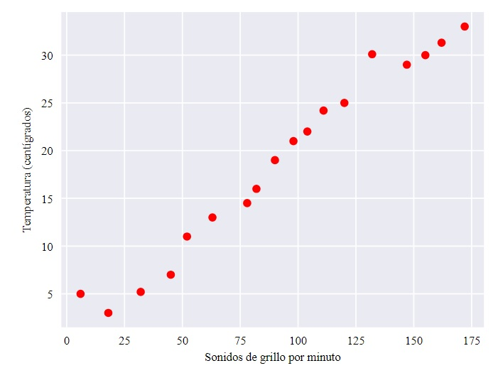
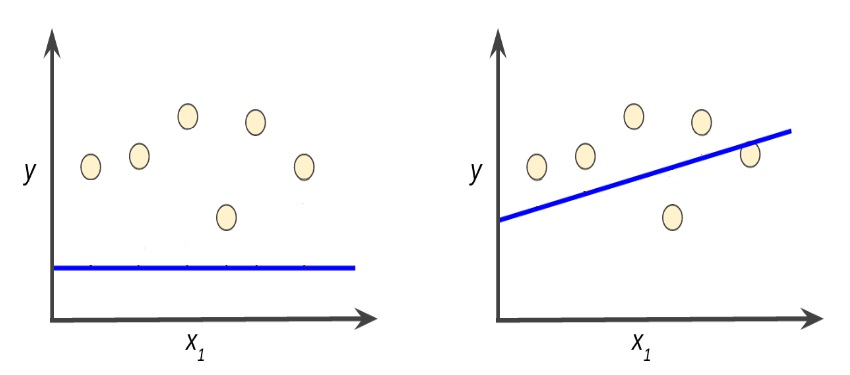
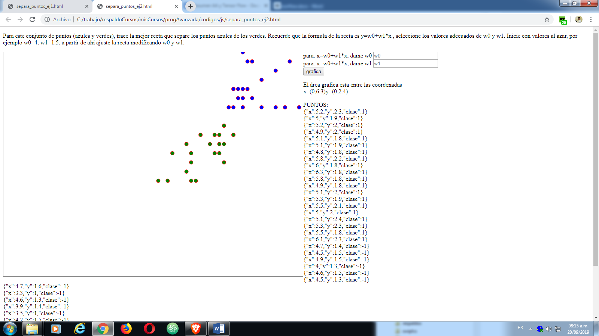
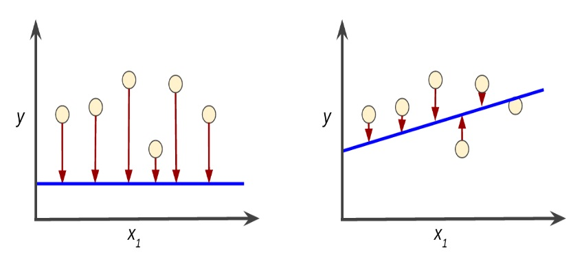
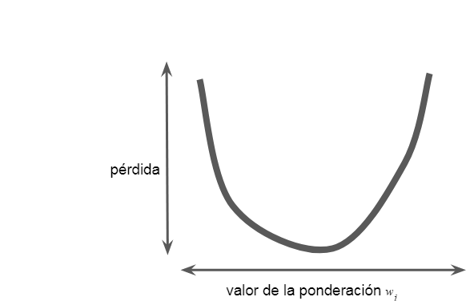
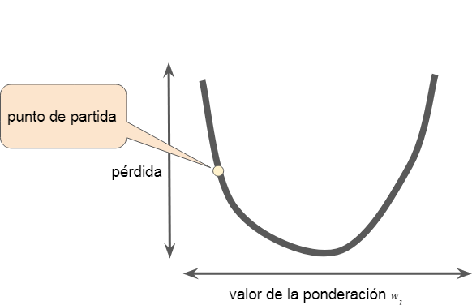
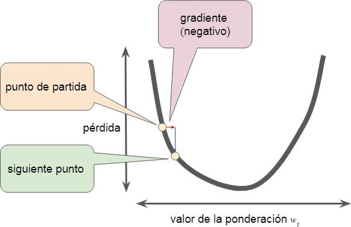
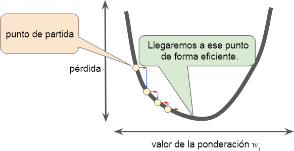

#### Ejemplo de regresión lineal

Suponga que un entomólogo realizó las observaciones de:

$cantosDeGrilloPorMinuto / temperaturaDelAmbiente$

obteniendo los siguientes datos:  

Y se observa una mayor cantidad de cantos a mayor temperatura, se puede observar que los datos tienen una relación lineal:

 Si queremos predecir la temperatura con base en el número de cantos por minuto de los grillos, usando la fórmula de la recta tenemos:  

$y'=mx+b$

Donde

$y$ = es la temperatura que queremos predecir
$m$ es la pendiente de la línea
$x$ es la cantidad de cantos por minuto
$b$ es la intersección de la recta en y.

Cambiando de notación:

$$y=w_0+w_1x_1$$

donde $w_0=b$, $w_1=m$

  
**Nota** Usaremos esta notación en AA:

Para modelos en más de dos dimensiones por ejemplo en 3D usaremos:

$$y=w_0+w_1x_1+w_2x_2+w_3x_3$$

#### Encontrar la recta

Para encontrar la recta puede usarse un proceso matemático (aunque a veces es muy complicado). Los métodos de AA sin embargo usan un enfoque iterativo, aquí usaremos el enfoque iterativo: trazar una recta aleatoria y ajustarla en cada iteración hasta obtener la mejor recta posible.

Para esto necesitamos un método que nos indique cuando una recta es \"mejor\" que otra, o se ajusta mejor a nuestro conjunto de datos.

En la siguiente imagen, cuál recta se ajusta mejor a nuestro conjunto de datos?:

Claramente se ve que la segunda opción es la mejor, pero cómo podemos calcularlo?

Ejercicio:

**Objetivo**: entender como una recta puede ajustar un conjunto de

puntos. **Actividades**: en la [liga](https://drive.google.com/open?id=1rtL1ob_2QbZV-fU51bu3m9met-my6bp9) encontrará un código en JS que muestra dos conjuntos de puntos como sigue:

Queremos encontrar una recta que separe ambos conjuntos de puntos (azules y verdes), para esto en los inputbox w0 y w1 debe poner un par de valores y probar si con esos valores obtiene la recta deseada.

Empiece por ejemplo con w0=1 y w1=0.5, cambie los valores de w0 y w1 hasta obtener la recta adecuada.

#### Función de pérdida

En nuestro enfoque iterativo construimos varios modelos (varias rectas) y buscamos minimizar la pérdida. La pérdida es una penalización por una predicción incorrecta, es un número que indica que tan incorrecta es la predicción, necesitamos un modelo que minimice la pérdida, a esto se le llama minimización del riesgo empírico.
  

En esta imagen las líneas rojas representan la distancia entre la observación y (círculo beige) y la predicción (la línea azul). Se ve claramente que la imagen de la izquierda tiene una pérdida mayor que la imagen de la derecha.

Una forma de calcular la pérdida es realizar las sumas de la pérdida de cada observación contra su predicción. Sin embargo como puede haber valores de pérdida positivos y negativos puede darse el caso en que la suma de cero pero haya mucha pérdida.

para evitar esto se utiliza la fórmula de error cuadrático medio ECM

(***mean squared error***)

  

donde:

- $(x,y)$ es un ejemplo en el que 
	- $x$ es el conjunto de atributos (p. ej., temperatura, edad y éxito para aparearse) que el modelo usa para realizar las predicciones. 
	  - $y$ es la etiqueta del ejemplo (p. ej., cantos por minuto).
- prediction(x) es un atributo de las ponderaciones y las ordenadas al origen en combinación con el conjunto de atributos x.
- D es el conjunto de datos que contiene muchos ejemplos etiquetados, que son los pares .
- N es la cantidad de ejemplos en D.

Si bien **ECM** se usa comúnmente en el aprendizaje automático, no es la única función de pérdida práctica ni la mejor para todas las circunstancias.

#### Reducción de pérdida por descenso de gradiente

Supón que tuviéramos el tiempo y los recursos de cómputo para calcular la pérdida de todos los valores posibles de wi. Para el tipo de problemas de regresión que hemos estado examinando, la representación resultante de pérdida frente a wi siempre será convexa. En otras palabras, la representación siempre tendrá forma de tazón, como la siguiente:

Esta es una gráfica convexa. Los problemas convexos tienen un solo mínimo, es decir, un solo lugar en el que la pendiente es exactamente 0. Ese mínimo es donde converge la función de pérdida.   

Calcular la función de pérdida para cada valor concebible de $w_i$ en todo el conjunto de datos sería una manera ineficaz de buscar el punto de convergencia. Examinemos un mecanismo más útil, muy popular en el aprendizaje automático, denominado descenso de gradientes.

La primera etapa en el descenso de gradientes es elegir un valor de inicio (un punto de partida) para $w_i$. El punto de partida no es muy importante; por lo tanto, muchos algoritmos simplemente establecen en 0 o eligen un valor al azar. En la siguiente figura, se muestra que elegimos un punto de partida levemente mayor que 0.

  

Luego, el algoritmo de descenso de gradientes calcula la gradiente de la curva de pérdida en el punto de partida. ***En resumen, un gradiente es un vector de derivadas parciales***; indica por dónde es más cerca o más lejos. Ten en cuenta que el gradiente de pérdida con respecto a un solo peso (como en la Figura 3) es equivalente a la derivada.

Ten en cuenta que el gradiente es un vector, de manera que tiene las dos características siguientes:

- una dirección
- una magnitud

El gradiente siempre apunta en la dirección del aumento más *empinado* de la función de pérdida. El algoritmo de descenso de gradientes toma un paso en dirección del gradiente negativo para reducir la pérdida lo más rápido posible.
  

  

Para determinar el siguiente punto a lo largo de la curva de la función de pérdida, el algoritmo de descenso de gradientes agrega alguna fracción de la magnitud del gradiente al punto de partida, como se muestra en la siguiente figura:
  

#### Tasa de aprendizaje

Como se observó, el vector de gradiente tiene una dirección y una magnitud. Los algoritmos de descenso de gradientes multiplican la gradiente por un escalar conocido como tasa de aprendizaje (o tamaño del paso en algunas ocasiones) para determinar el siguiente punto. Por ejemplo, si la magnitud de la gradiente es 2.5 y la tasa de aprendizaje es 0.01, el algoritmo de descenso de gradientes tomará el siguiente punto 0.025 más alejado del punto anterior.

Los hiper parámetros son los controles que los programadores ajustan en los algoritmos de aprendizaje automático. La mayoría de los programadores de aprendizaje automático pasan gran parte de su tiempo ajustando la tasa de aprendizaje. Si eliges una tasa de aprendizaje muy  pequeña, el aprendizaje llevará demasiado tiempo:

A la inversa, si especificas una tasa de aprendizaje muy grande, el siguiente punto rebotara al azar eternamente en la parte inferior, como un experimento de mecánica cuántica que salió muy mal:
  

Hay una tasa de aprendizaje con valor *dorado* para cada problema de regresión. El valor *dorado* está relacionado con qué tan plana es la función de pérdida. Si sabes que el gradiente de la función de pérdida es pequeño, usa una tasa de aprendizaje mayor, que compensará el gradiente pequeño y dará como resultado un tamaño del paso más grande.

#### Descenso de gradiente estocástico SGD

En el descenso de gradientes, ***un lote es la cantidad total de ejemplos que usas para calcular la gradiente en una sola iteración***.

Hasta ahora, hemos supuesto que el lote era el conjunto de datos completo. Al trabajar a la escala de Google, los conjuntos de datos suelen tener miles de millones o incluso cientos de miles de millones de ejemplos. Además, los conjuntos de datos de Google con frecuencia contienen inmensas cantidades de atributos. En consecuencia, un lote puede ser enorme. Un lote muy grande puede causar que incluso una sola iteración tome un tiempo muy prolongado para calcularse.

Es probable que un conjunto de datos grande con ejemplos muestreados al azar contenga datos redundantes. De hecho, la redundancia se vuelve más probable a medida que aumenta el tamaño del lote. Un poco de redundancia puede ser útil para atenuar las gradientes inconsistentes, pero los lotes enormes tienden a no tener un valor mucho más predictivo que los lotes grandes.

¿Cómo sería si pudiéramos obtener la gradiente correcta en promedio con mucho menos cómputo? Al elegir ejemplos al azar de nuestro conjunto de datos, podríamos estimar (si bien de manera inconsistente) un promedio grande de otro mucho más pequeño. El descenso de gradiente estocástico (SGD) lleva esta idea al extremo: usa un solo ejemplo (un tamaño del lote de 1) por iteración. Cuando se dan demasiadas iteraciones, el SGD funciona, pero es muy inconsistente. El término \"estocástico\" indica que el ejemplo único que compone cada lote se elige al azar. El descenso de gradiente estocástico de mini lote (SGD de mini lote) es un equilibrio entre la iteración de lote completo y el SGD. Un mini lote generalmente tiene entre 10 y 1,000 ejemplos, elegidos al azar. El SGD de mini lote reduce la cantidad de inconsistencia en el SGD, pero sigue siendo más eficaz que el lote completo.

Para simplificar la explicación, nos concentramos en el descenso de gradientes para un solo atributo. Te garantizamos que el descenso de gradientes también funciona en conjuntos de varios atributos.

Referencia:
  
[google](https://developers.google.com/machine-learning/crash-course/reducing-loss/stochastic-gradient-descent?hl=es-419)

[[Regresión logística]]
