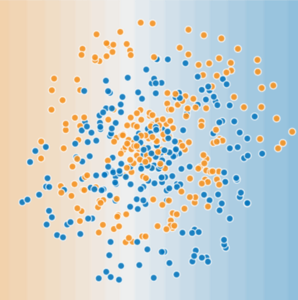
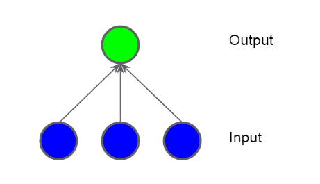
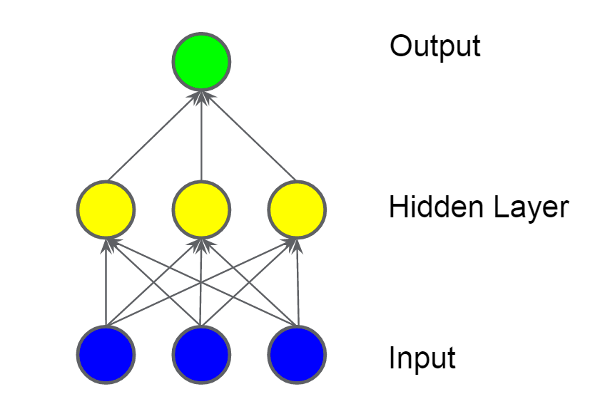
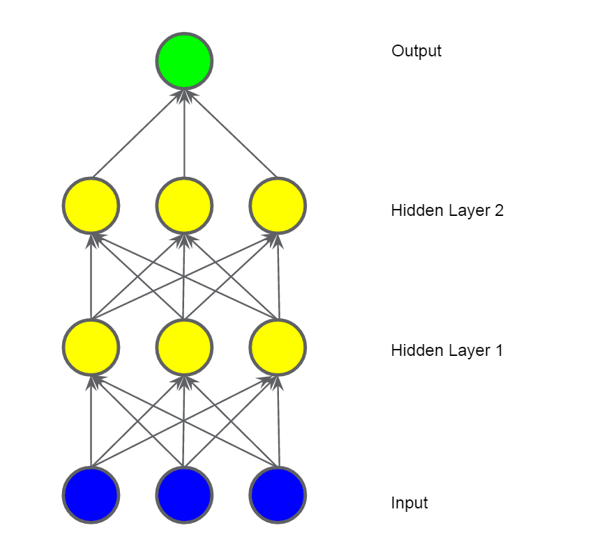
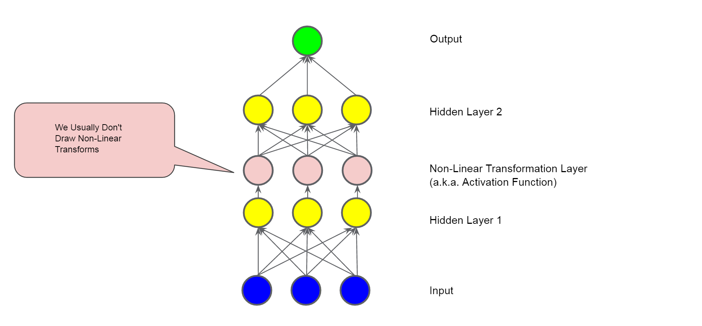
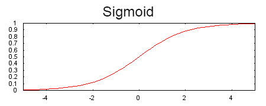
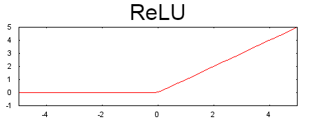
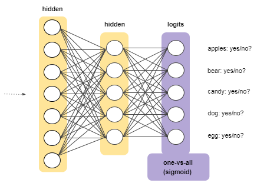
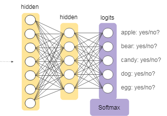

## Red neuronal

Para problemas no lineales como:

  
Puntos no linealmente separables

Las redes neuronales pueden ayudar con problemas no lineales, comencemos por representar un modelo lineal como un gráfico:

Cada círculo azul representa una característica de entrada, y el círculo verde representa la suma ponderada de las entradas.

¿Cómo podemos alterar este modelo para mejorar su capacidad para lidiar con problemas no lineales?
### Capas ocultas

En el modelo representado por el siguiente gráfico, hemos agregado una \"capa oculta\" de valores intermedios. Cada nodo amarillo en la capa oculta es una suma ponderada de los valores del nodo de entrada azul. La salida es una suma ponderada de los nodos amarillos.

  
¿Es este modelo lineal? Sí, su salida sigue siendo una combinación lineal de sus entradas.

En el modelo representado por el siguiente gráfico, hemos agregado una segunda capa oculta de sumas ponderadas.

¿Este modelo sigue siendo lineal? Sí lo es. Cuando expresa la salida como una función de la entrada y simplifica, obtiene solo otra suma ponderada de las entradas. Esta suma no modelará efectivamente el problema no lineal en la Figura que muestra los puntos no linealmente separables.

### Función de activación.

Para modelar un problema no lineal, podemos introducir directamente una no linealidad. Podemos canalizar cada nodo de capa oculta a través de una función no lineal.

En el modelo representado por el siguiente gráfico, el valor de cada nodo en la capa oculta 1 se transforma mediante una función no lineal antes de pasar a las sumas ponderadas de la siguiente capa. Esta función no lineal se llama función de activación.

Ahora que hemos agregado una función de activación, agregar capas tiene más impacto. Apilar las no linealidades en las no linealidades nos permite modelar relaciones muy complicadas entre las entradas y las salidas predichas. En resumen, cada capa está aprendiendo efectivamente una función más compleja y de alto nivel sobre las entradas sin procesar. Si desea desarrollar más intuición sobre cómo funciona esto,

vea la excelente publicación de blog de Chris Olah:

[[https://colah.github.io/posts/2014-03-NN-Manifolds-Topology/]{.underline}](https://colah.github.io/posts/2014-03-NN-Manifolds-Topology/)

  
### Funciones comunes de activación.

La siguiente función de activación sigmoidea convierte la suma ponderada en un valor entre 0 y 1.

$F(x)=1/(1-e^-x^)$

  

La siguiente función de activación de unidad lineal rectificada (o ReLU, para abreviar) a menudo funciona un poco mejor que una función suave como el sigmoide, a la vez que es  significativamente más fácil de calcular.

$F(x)=max(0,x)$  

  

De hecho, cualquier función matemática puede servir como una función de activación. Supongamos que representa nuestra función de activación (Relu, Sigmoid o lo que sea). En consecuencia, el valor de un nodo en la red viene dado por la siguiente fórmula:

∂(wx+b)

TensorFlow proporciona compatibilidad inmediata para una amplia variedad de funciones de activación. Dicho esto, todavía recomendamos comenzar con ReLU.

### Mejores prácticas

Esta sección explica los casos de falla de propagación hacia atrás y la forma más común de regularizar una red neuronal.

Hay varias formas comunes de que la retropropagación salga mal. Los gradientes para las capas inferiores (más cercanas a la entrada) pueden volverse muy pequeños. En redes profundas, calcular estos gradientes puede implicar tomar el producto de muchos términos pequeños. Cuando los gradientes tienden a 0 para las capas inferiores, estas capas se entrenan muy lentamente, o nada en absoluto.

La función de activación ReLU puede ayudar a prevenir la desaparición de gradientes.

Si los pesos en una red son muy grandes, entonces los gradientes para las capas inferiores involucran productos de muchos términos grandes. En este caso, puede tener gradientes explosivos: gradientes que se vuelven demasiado grandes para converger.

La normalización por lotes puede ayudar a evitar la explosión de gradientes, al igual que puede reducir la tasa de aprendizaje.

Una vez que la suma ponderada de una unidad ReLU cae por debajo de 0, la unidad ReLU puede atascarse. Produce 0 activaciones, sin aportar nada a la salida de la red, y los gradientes ya no pueden fluir a través de ella durante la propagación hacia atrás. Con una fuente de gradientes cortada, la entrada a ReLU puede no cambiar lo suficiente como para que la suma ponderada vuelva a estar por encima de 0.

Bajar la tasa de aprendizaje puede ayudar a evitar que las unidades ReLU mueran.

Otra forma de regularización, llamada Dropout, es útil para las redes neuronales. Funciona cuando al azar \"dropping out\" (abandonamos ) aleatoriamente las activaciones de la unidad en una red para un solo paso de gradiente. Cuanto más abandones, más fuerte será la

regularización:

- 0.0 = Sin regularización de abandono.
- 1.0 = Eliminar todo. El modelo no aprende nada.
- Valores entre 0.0 y 1.0 = Más útil.
### Redes multicapas One vs. all

proporciona una manera de aprovechar la clasificación binaria. Dado un problema de clasificación con N posibles soluciones, una solución de uno contra todos consiste en N clasificadores binarios separados, un clasificador binario para cada resultado posible. Durante el entrenamiento, el modelo recorre una secuencia de clasificadores binarios, entrenando a cada uno para responder una pregunta de clasificación por separado. Por ejemplo, dada una imagen de un perro, se pueden entrenar cinco reconocedores diferentes, cuatro ven la imagen como un ejemplo negativo (no un perro) y uno ve la imagen como un ejemplo positivo (un perro). Es decir:

- ¿Es esta imagen una manzana? No.
- ¿Es esta imagen un oso? No.
- ¿Es esta imagen dulce? No.
- ¿Es esta imagen un perro? Si.
- ¿Es esta imagen un huevo? No.

Este enfoque es bastante razonable cuando el número total de clases es pequeño, pero se vuelve cada vez más ineficiente a medida que aumenta el número de clases.

Podemos crear un modelo uno contra todo significativamente más eficiente con una red neuronal profunda en la que cada nodo de salida  una clase diferente. La siguiente figura sugiere este enfoque:

### Softmax

Recuerde que la regresión logística produce un decimal entre 0 y 1.0. Por ejemplo, una salida de regresión logística de 0.8 de un clasificador de correo electrónico sugiere un 80% de probabilidad de que un correo electrónico sea spam y un 20% de probabilidad de que no sea spam.

Claramente, la suma de las probabilidades de que un correo electrónico sea spam o no spam es 1.0.

Softmax extiende esta idea a un mundo de múltiples clases. Es decir, Softmax asigna probabilidades decimales a cada clase en un problema de varias clases. Esas probabilidades decimales deben sumar 1.0. Esta restricción adicional ayuda a que el entrenamiento converja más rápidamente de lo que lo haría de otra manera.

Por ejemplo, volviendo al análisis de imagen que vimos en la Figura anterior, Softmax podría producir las siguientes probabilidades de que una imagen pertenezca a una clase particular:

|Class                               | Probability|
|------------------------------------|-----------|
|apple                               | 0.001 |
|bear                                | 0.04 |
|candy                               | 0.008 |
|dog                                 |0.95 |
|egg                                 | 0.001 |

  

Softmax se implementa a través de una capa de red neuronal justo antes de la capa de salida. La capa Softmax debe tener el mismo número de nodos que la capa de salida.

  

  

Opciones de softmax

Considere las siguientes variantes de Softmax:

- Softmax completo es el Softmax que hemos estado discutiendo; es decir,   Softmax calcula una probabilidad para cada clase posible.
- El muestreo de candidatos significa que Softmax calcula una   probabilidad para todas las etiquetas positivas pero solo para una   muestra aleatoria de etiquetas negativas. Por ejemplo, si estamos interesados ​​en determinar si una imagen de entrada es un beagle o un   sabueso, no tenemos que proporcionar probabilidades para cada ejemplo que no sea perrito.

  

Full Softmax es bastante barato cuando el número de clases es pequeño, pero se vuelve prohibitivamente caro cuando el número de clases aumenta. 

El muestreo de candidatos puede mejorar la eficiencia en problemas que tienen un gran número de clases.

Softmax asume que cada ejemplo es miembro de exactamente una clase. Sin embargo, algunos ejemplos pueden ser simultáneamente miembros de múltiples clases. Para tales ejemplos:

- No puede usar Softmax.
- Debe confiar en múltiples regresiones logísticas.

Por ejemplo, suponga que sus ejemplos son imágenes que contienen exactamente un elemento: una pieza de fruta. Softmax puede determinar la probabilidad de que ese elemento sea una pera, una naranja, una manzana, etc. Si sus ejemplos son imágenes que contienen todo tipo de cosas (cuencos de diferentes tipos de fruta), tendrá que usar múltiples regresiones logísticas.

[aquí me quede:](https://developers.google.com/machine-learning/crash-course/embeddings/motivation-from-collaborative-filtering)

[[Tensor Flow]]