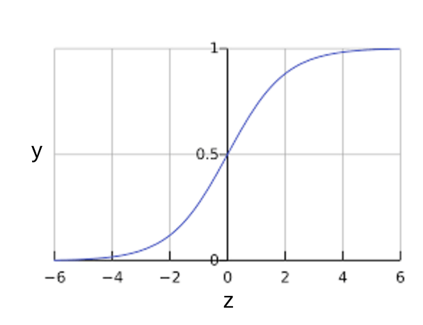
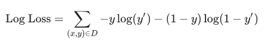

#### Regresión logística

Muchos problemas requieren una estimación de probabilidad como salida. La regresión logística es un mecanismo extremadamente eficiente para calcular probabilidades. Hablando en términos prácticos, puede usar la probabilidad devuelta en cualquiera de las dos formas siguientes:

- \"tal cual\"
- Convertido a una categoría binaria.

Consideremos cómo podríamos usar la probabilidad \"tal cual\".

Supongamos que creamos un modelo de regresión logística para predecir la probabilidad de que un perro ladre durante la mitad de la noche.

Llamaremos a esa probabilidad:

$p (ladrido | noche)$

Si el modelo de regresión logística predice una ***p (ladrido \| noche)*** de 0.05, entonces, durante un año, los dueños del perro deben sobresaltarse aproximadamente 18 veces:

$sobresalto= p (ladrido | noche) * noches$
$=0.05*365$
$=18$

En muchos casos, asignará la salida de regresión logística en la solución a un problema de clasificación binaria, en el que el objetivo es predecir correctamente una de las dos etiquetas posibles (por ejemplo, \"spam\" o \"no spam\"). Un módulo posterior se centra en eso.

Tal vez se pregunte cómo un modelo de regresión logística puede garantizar resultados que siempre se encuentren entre 0 y 1. Como sucede?, una función sigmoide, definida de la siguiente manera, produce resultados que tienen esas mismas características:

$y=1/(1+e^{-z})$
  

Si z representa la salida de la capa lineal de un modelo entrenado con regresión logística, entonces sigmoide (z) arrojará un valor (una probabilidad) entre 0 y 1. En términos matemáticos:

$y'=1/(1+e^{-z})$

dónde:

- $y '$ es la salida del modelo de regresión logística para un ejemplo particular.

- $z=b+w_1x_1+w_2x_2+\dots+w_nx_n$

#### Función de pérdida para regresión logística

La función de pérdida para la regresión lineal es la pérdida al cuadrado. La función de pérdida para la regresión logística es la pérdida de registro, que se define de la siguiente manera:  

Donde:

- (x, y) en D es el conjunto de datos que contiene muchos ejemplos   etiquetados, que son pares (x, y).
- y es la etiqueta en un ejemplo etiquetado. Como se trata de una regresión logística, cada valor de y debe ser 0 o 1.
- y' es el valor predicho (en algún lugar entre 0 y 1), dado el conjunto de características en x.

La ecuación para la pérdida de registro está estrechamente relacionada con la medida de entropía de Shannon de la teoría de la información.

También es el logaritmo negativo de la función de verosimilitud, suponiendo una distribución de Bernoulli de y. De hecho, minimizar la función de pérdida produce una estimación de probabilidad máxima.

#### Regularización en regresión logística

La regularización es extremadamente importante en el modelado de regresión logística. Sin regularización, la naturaleza asintótica de la regresión logística seguiría impulsando la pérdida hacia 0 en altas dimensiones. En consecuencia, la mayoría de los modelos de regresión logística utilizan una de las dos estrategias siguientes para amortiguar la complejidad del modelo:

- L2 regularization.
- Pararse temprano, es decir, limitar el número de pasos de  entrenamiento o la tasa de aprendizaje.

(Discutiremos una tercera estrategia, la regularización L1, en un módulo posterior).

Imagine que asigna una identificación única a cada ejemplo y asigna cada identificación a su propia función. Si no especifica una función de regularización, el modelo quedará completamente *sobre ajustado*. Esto se debe a que el modelo trataría de llevar la pérdida a cero en todos los ejemplos y nunca llegaría allí, llevando los pesos de cada función de indicador a + infinito o -infinito. Esto puede suceder en datos de alta dimensión con cruces de entidades, cuando hay una gran cantidad de cruces raros que ocurren solo en un ejemplo cada uno.

Afortunadamente, usar L2 o pararse temprano evitará este problema.

[[Clasificación]]