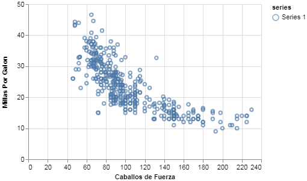
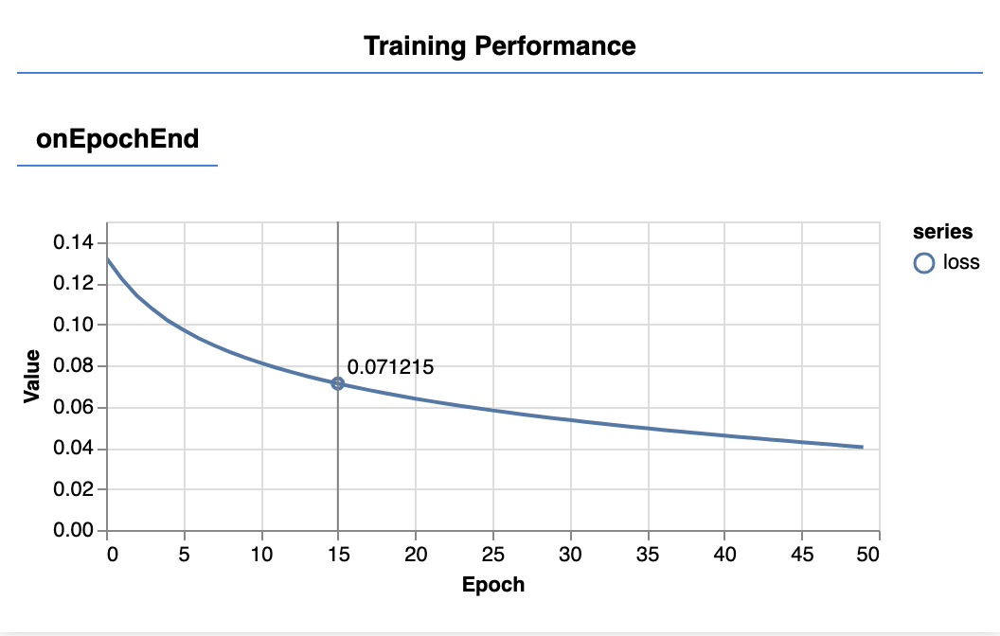
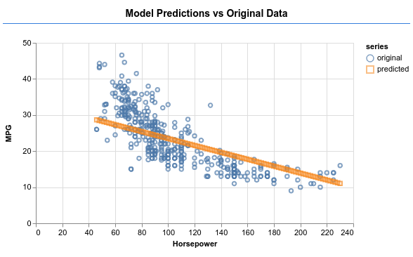
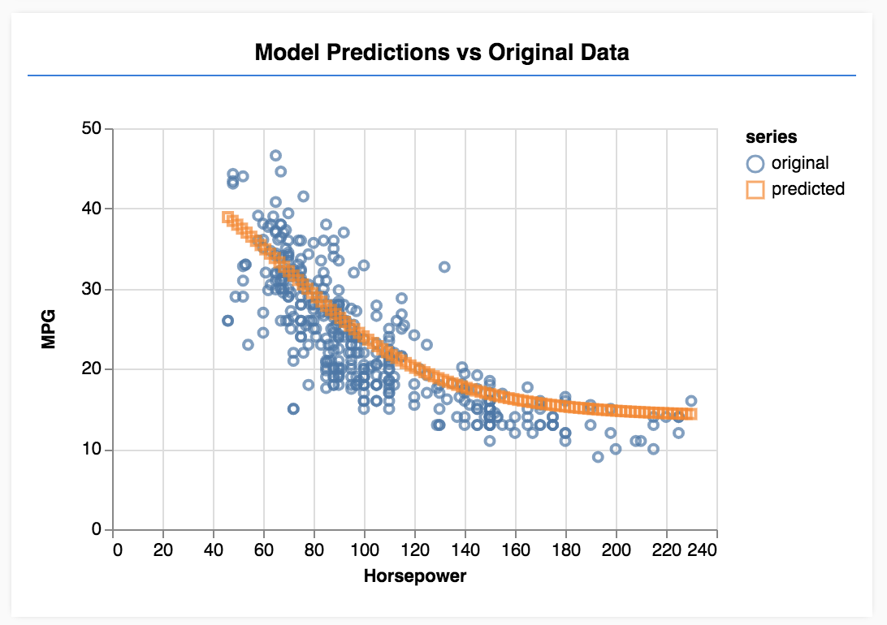

## Tensor Flow

Tensoflow es un framework para realizar cálculos usando tensores en JS. Un tensor es la generalización de un vector o matriz en altas dimensiones. La unidad central de datos en TF son los tf.Tensor que es un conjunto de valores conformado en un arreglo de 1 o más dimensiones.

### Regresión lineal con TF

Veamos un ejemplo de su uso obtenido de:

[regresion colab](https://codelabs.developers.google.com/codelabs/tfjs-training-regression/index.html#0) 

  

En este ejemplo entrenaremos un modelo para hacer predicciones sobre datos que describen un conjunto de autos, este es un problema de regresión lineal.

Google tiene disponible un conjunto de datos de prueba que contiene información sobre autos, esta en formato JSON y la puede obtener desde la liga: [datos prueba](https://storage.googleapis.com/tfjs-tutorials/carsData.json)


Escriba esta liga en su navegador, deberá ver en su ventana un conjunto de datos json como el siguiente:

```json

[

  {

    "Name": "chevrolet chevelle malibu",
    "Miles_per_Gallon": 18,
    "Cylinders": 8,
    "Displacement": 307,
    "Horsepower": 130,
    "Weight_in_lbs": 3504,
    "Acceleration": 12,
    "Year": "1970-01-01",
    "Origin": "USA"
  },

  {

    "Name": "buick skylark 320",
    "Miles_per_Gallon": 15,
    "Cylinders": 8,
    "Displacement": 350,
    "Horsepower": 165,
    "Weight_in_lbs": 3693,
    "Acceleration": 11.5,
    "Year": "1970-01-01",
    "Origin": "USA"
  },

…

]

```

### Leer los datos.

Ahora escribimos un código que lea estos datos desde js, cómo usaremos la función fetch se requiere que este ejemplo corra sobre un servidor, para este ejemplo tengo instalado WAMP SERVER, requerimos los siguientes 2 archivos que yo guarde en la carpeta:

www/pruebas/pruebas-tf:

```html

<!DOCTYPE html>
<html>
<head>
  <title>tutorial TensorFlow.js </title>
  <!-- Import TensorFlow.js -->
  <script src="https://cdn.jsdelivr.net/npm/@tensorflow/tfjs@1.0.0/dist/tf.min.js"> 
  </script>
  <!-- Import tfjs-vis -->
  <script src="https://cdn.jsdelivr.net/npm/@tensorflow/tfjs-vis@1.0.2/dist/tfjs-vis.umd.min.js"></script>
  <script src="script.js"></script>
</head>
<body>
</body>
</html>
```

```js

//archivo: script.js

async function getData() {
    const carsDataReq = await fetch('https://storage.googleapis.com/tfjs-tutorials/carsData.json');  
    const carsData = await carsDataReq.json();  
    const cleaned = carsData.map(car => ({
      mpg: car.Miles_per_Gallon,
      horsepower: car.Horsepower,
    }))
    .filter(car => (car.mpg != null && car.horsepower != null));
    document.write (JSON.stringify(cleaned));
    return cleaned;
  }
document.addEventListener('DOMContentLoaded', getData);

```


Al probar el ejemplo desde su navegador:

[[http://localhost/pruebas/pruebas-tf/index.html]]

verá datos como los siguientes:
```text

[{"mpg":18,"horsepower":130},{"mpg":15,"horsepower":165},...

```


Cómo ve la función getData filtro solo 2 atributos del archivo de entrada: millas por galón (mpg) y caballos de fuerza.
 

### Graficando los datos.

Cambiaremos el contenido del archivo script.js por el siguiente:

```js

async function getData() {
    const carsDataReq = await fetch('https://storage.googleapis.com/tfjs-tutorials/carsData.json');  
    const carsData = await carsDataReq.json();  
    const cleaned = carsData.map(car => ({
      mpg: car.Miles_per_Gallon,
      horsepower: car.Horsepower,
    }))
    .filter(car => (car.mpg != null && car.horsepower != null));
    return cleaned;
  }

  async function run() {
    // Load and plot the original input data that we are going to train on.
    const data = await getData();
    const values = data.map(d => ({
      x: d.horsepower,
      y: d.mpg,
    }));

    tfvis.render.scatterplot(
      {name: 'caballos de fuerza vs Millas Por Galon'},
      {values},
      {
        xLabel: 'Caballos de Fuerza',
        yLabel: 'Millas Por Galon',
        height: 300
      }
    );
    // More code will be added below
  }

  document.addEventListener('DOMContentLoaded', run);

```


Verá la siguiente gráfica:



### Modelo

  
En esta sección escribiremos código para describir la arquitectura del modelo. La arquitectura del modelo es solo una forma elegante de decir "qué funciones ejecutará el modelo cuando se esté ejecutando", o alternativamente \"qué algoritmo utilizará nuestro modelo para calcular sus respuestas\".


Los modelos Machine Learning (ML) son algoritmos que toman una entrada producen una salida. Cuando se utilizan redes neuronales, el algoritmo es un conjunto de capas de neuronas con "pesos" (números) que rigen su salida. El proceso de capacitación aprende los valores ideales para esos pesos.

Agregue el siguiente código a su archivo script.js:

```js

function createModel() {
  // Create a sequential model
  const model = tf.sequential();
  // Add a single hidden layer
  model.add(tf.layers.dense({inputShape: [1], units: 1, useBias: true}));
  // Add an output layer
  model.add(tf.layers.dense({units: 1, useBias: true})); 

  return model;
}

```

  
Este es uno de los modelos más simples que podemos definir en tensorflow.js, analicemos un poco cada línea. 


Instanciar el modelo:

```js
const model = tf.sequential();
```


Esto crea una instancia de un objeto **tf.Model**. Este modelo es secuencial porque sus entradas fluyen directamente hacia su salida. Otros tipos de modelos pueden tener ramificaciones, o incluso múltiples entradas y salidas, pero en muchos casos sus modelos serán secuenciales. Los modelos secuenciales también tienen una API más fácil de usar.


Agregar capas

```js
model.add(tf.layers.dense({
	inputShape: [1], 
	units: 1, 
	useBias: true
}));
```

  

Esto agrega una capa oculta a nuestra red. Una capa densa es un tipo de capa que multiplica sus entradas por una matriz (llamada pesos) y luego agrega un número (llamado sesgo) al resultado. Como esta es la primera capa de la red, necesitamos definir nuestra inputShape. InputShape es \[1\] porque tenemos 1 número como entrada (los caballos de fuerza de un automóvil dado).

**units** establece qué tan grande será la matriz de peso en la capa. Al establecerlo en 1 aquí, estamos diciendo que habrá 1 peso para cada una de las características de entrada de los datos.

  

***Nota***: Las capas densas vienen con un término de sesgo de forma predeterminada, por lo que no necesitamos establecer **useBias** en true, omitiremos las llamadas posteriores a **tf.layers.dense**.

```js
model.add(tf.layers.dense({units: 1}));
```


El código anterior crea nuestra capa de salida. Establecemos units en 1 porque queremos generar 1 número.

En este ejemplo, debido a que la capa oculta tiene 1 unidad, en realidad no necesitamos agregar la capa de salida final arriba (es decir, podríamos usar la capa oculta como la capa de salida). Sin embargo, la definición de una capa de salida separada nos permite modificar el número de unidades en la capa oculta mientras se mantiene el mapeo uno a uno de entrada y salida.

### Creando una instancia

agregue el siguiente código a su función run.

  
```js
// Create the model
const model = createModel();
tfvis.show.modelSummary({name: 'Model Summary'}, model);
```

Esto creará una instancia del modelo y mostrará un resumen de las capas en la página web.

### Prepare los datos para el entrenamiento

Para obtener los beneficios de rendimiento de TensorFlow.js que hacen que los modelos de aprendizaje automático sean prácticos, necesitamos convertir nuestros datos en tensores. También realizaremos una serie de transformaciones en nuestros datos que son las mejores prácticas, a saber, barajar y normalizar.

agregue el siguiente código a su archivo script.js

```js

/**
 * Convert the input data to tensors that we can use for machine
 * learning. We will also do the important best practices of _shuffling_
 * the data and _normalizing_ the data
 * MPG on the y-axis.
 */
function convertToTensor(data) {
  // envolviendo estos cálculos en el método tidy se eliminaran
  // los tensores intermedios.
  return tf.tidy(() => {
    // Step 1. aleatorizar los datos    
    tf.util.shuffle(data);
 
    // Step 2. Convertir data a Tensor
    const inputs = data.map(d => d.horsepower)
    const labels = data.map(d => d.mpg);
  
    const inputTensor = tf.tensor2d(inputs, [inputs.length, 1]);
    const labelTensor = tf.tensor2d(labels, [labels.length, 1]);
  
    //Step 3. Normalizar los data al el rango 0 - 1 usando escala min-max
    const inputMax = inputTensor.max();
    const inputMin = inputTensor.min();  
    const labelMax = labelTensor.max();
    const labelMin = labelTensor.min();
  
    const normalizedInputs = inputTensor.sub(inputMin).div(inputMax.sub(inputMin));
    const normalizedLabels = labelTensor.sub(labelMin).div(labelMax.sub(labelMin));
  
    return {
      inputs: normalizedInputs,
      labels: normalizedLabels,
      // Return the min/max bounds so we can use them later.
      inputMax,
      inputMin,
      labelMax,
      labelMin,
    }
  });  
}
  
```
Explicación del código:
  
```js
//Step 1. Shuffle the data:
tf.util.shuffle(data);
```


Aquí aleatorizamos el orden de los ejemplos que alimentaremos al algoritmo de entrenamiento. La combinación aleatoria es importante porque normalmente durante el entrenamiento el conjunto de datos se divide en subconjuntos más pequeños, llamados lotes, en los que se entrena el modelo. La combinación aleatoria ayuda a que cada lote tenga una variedad de datos de toda la distribución de datos. Al hacerlo, ayudamos al modelo:

***Mejor práctica 1***: siempre debe barajar sus datos antes de entregarlos a los algoritmos de entrenamiento en TensorFlow.js.

Convertir a tensores.

```js
// Step 2. Convert data to Tensor*
const inputs = data.map(d => d.horsepower)
const labels = data.map(d => d.mpg);
const inputTensor = tf.tensor2d(inputs, [inputs.length, 1]);
const labelTensor = tf.tensor2d(labels, [labels.length, 1]);
```

Aquí hacemos dos matrices, una para nuestros ejemplos de entrada (las entradas de caballos de fuerza) inputs y otra para los valores de salida verdaderos (que se conocen como etiquetas en el aprendizaje automático) labels.

Luego convertimos cada dato de matriz a un tensor 2D. El tensor tendrá una forma de \[num_examples, num_caracteristicas_por_example\]. Aquí tenemos inputs.length ejemplos y cada ejemplo tiene 1 característica de entrada (los caballos de fuerza).

Normalizar los datos

```js
//Step 3. Normalize the data to the range 0 - 1 using min-max scaling*  
const inputMax = inputTensor.max();
const inputMin = inputTensor.min();
const labelMax = labelTensor.max();
const labelMin = labelTensor.min();  
const normalizedInputs =
inputTensor.sub(inputMin).div(inputMax.sub(inputMin));
  
const normalizedLabels =
labelTensor.sub(labelMin).div(labelMax.sub(labelMin));
```

  
A continuación, hacemos otra práctica recomendada para la capacitación en aprendizaje automático. Normalizamos los datos. Aquí normalizamos los datos en el rango numérico 0-1 usando la escala min-max. La normalización es importante porque los componentes internos de muchos modelos de aprendizaje automático que construirá con tensorflow.js están diseñados para trabajar con números que no son demasiado grandes. Rangos comunes para normalizar datos para incluir 0 a 1 o -1 a 1. Tendrá más éxito entrenando a sus modelos si se acostumbra a normalizar sus datos a un rango razonable.

***Mejor práctica 2***: siempre debe considerar normalizar sus datos antes de entrenar. Algunos conjuntos de datos se pueden aprender sin normalización, pero la normalización de sus datos a menudo eliminará toda una clase de problemas que evitarían un aprendizaje efectivo.

Puede normalizar sus datos antes de convertirlos en tensores. Lo hacemos después porque podemos aprovechar la vectorización en TensorFlow.js para realizar las operaciones de escalado min-max sin escribir ningún explícito para los bucles.

Devuelve los datos y los límites de normalización.

```js
return {
 inputs: normalizedInputs,
 labels: normalizedLabels,
 // Return the min/max bounds so we can use them later.*
 inputMax,
 inputMin,
 labelMax,
 labelMin,
}
```


  
Queremos mantener los valores que usamos para la normalización durante el entrenamiento para que podamos normalizar las salidas para volver a nuestra escala original y permitirnos normalizar los datos de entrada futuros de la misma manera.

### Entrenar el modelo

Con nuestra instancia de modelo creada y nuestros datos representados como tensores, tenemos todo listo para comenzar el proceso de capacitación.

```js

async function trainModel(model, inputs, labels) {
  // Prepare the model for training.  
  model.compile({
    optimizer: tf.train.adam(),
    loss: tf.losses.meanSquaredError,
    metrics: ['mse'],
  });
  const batchSize = 32;
  const epochs = 50;
  return await model.fit(inputs, labels, {
    batchSize,
    epochs,
    shuffle: true,
    callbacks: tfvis.show.fitCallbacks(
      { name: 'Training Performance' },
      ['loss', 'mse'],
      { height: 200, callbacks: ['onEpochEnd'] }
    )
  });
}

```

  
Analicemos el código:

Preparándose para el entrenamiento

```js

// Prepare the model for training.  
model.compile({
  optimizer: tf.train.adam(),
  loss: tf.losses.meanSquaredError,
  metrics: ['mse'],
});
```

  

Tenemos que \"compilar\" el modelo antes de entrenarlo. Para hacerlo, tenemos que especificar una serie de cosas muy importantes:   

- optimizador: Este es el algoritmo que regirá las actualizaciones del   modelo, ya que ve ejemplos. Hay muchos optimizadores disponibles en  TensorFlow.js. Aquí hemos elegido el optimizador adam, ya que es bastante efectivo en la práctica y no requiere configuración.
- pérdida: esta es una función que le dirá al modelo qué tan bien le está yendo al aprender cada uno de los lotes (subconjuntos de datos) que se muestra. Aquí usamos meanSquaredError para comparar las predicciones hechas por el modelo con los valores verdaderos.


```js
const batchSize = 32;
const epochs = 50;
```

A continuación, elegimos un batchSize y varias épocas:

- batchSize se refiere al tamaño de los subconjuntos de datos que el modelo verá en cada iteración de entrenamiento. Los tamaños de lote comunes tienden a estar en el rango de 32-512. Realmente no hay un tamaño de lote ideal para todos los problemas y está más allá del   alcance de este tutorial para describir las motivaciones matemáticas para varios tamaños de lote.
- épocas se refiere a la cantidad de veces que el modelo mirará todo el conjunto de datos que usted le proporcione. Aquí tomaremos 50 iteraciones a través del conjunto de datos.

Iniciar el loop de entrenamiento

```js
return await model.fit(inputs, labels, {
  batchSize,
  epochs,
  callbacks: tfvis.show.fitCallbacks(
    { name: 'Training Performance' },
    ['loss', 'mse'],
    { height: 200, callbacks: ['onEpochEnd'] }
  )
}); 
```

  
  

model.fit es la función que llamamos para iniciar el ciclo de entrenamiento. Es una función asincrónica, por lo que le devolvemos la promesa que nos brinda para que la persona que llama pueda determinar cuándo se completa el entrenamiento.

Para monitorear el progreso de la capacitación, pasamos una callback a model.fit. Usamos tfvis.show.fitCallbacks para generar funciones que tracen gráficos para la métrica \"pérdida\" y \"mse\" que especificamos anteriormente.

  

Todo junto

Ahora tenemos que llamar a las funciones que hemos definido desde nuestra función de ejecución.

Agregue el siguiente código al final de su función run.

```js
// Convert the data to a form we can use for training.
const tensorData = convertToTensor(data);
const {inputs, labels} = tensorData;
// Train the model  
await trainModel(model, inputs, labels);
console.log('Done Training'); 
```

  
  

Cuando actualice la página, después de unos segundos, debería ver la actualización de los siguientes gráficos.



Estos son creados por las callback que creamos anteriormente. Muestran la pérdida y la mse, promediadas en todo el conjunto de datos, al final de cada época.

Cuando entrenamos a un modelo, queremos ver cómo baja la pérdida. En este caso, debido a que nuestra métrica es una medida de error, también queremos que disminuya.

Si quieres entender lo que sucede debajo del capó durante el entrenamiento. Lee nuestra guía o mira esto:

[[https://www.youtube.com/watch?v=IHZwWFHWa-w]]

### Hacer predicciones

Ahora que nuestro modelo está entrenado, queremos hacer algunas predicciones. Vamos a evaluar el modelo al ver lo que predice para un rango uniforme de números de horsepower bajas a altas.   

Agregue la siguiente función a su archivo script.js

```js
function testModel(model, inputData, normalizationData) {
  const {inputMax, inputMin, labelMin, labelMax} = normalizationData;  
  // Generate predictions for a uniform range of numbers between 0 and 1;
  // We un-normalize the data by doing the inverse of the min-max scaling
  // that we did earlier.
  const [xs, preds] = tf.tidy(() => {
    const xs = tf.linspace(0, 1, 100);      
    const preds = model.predict(xs.reshape([100, 1]));      
    const unNormXs = xs
      .mul(inputMax.sub(inputMin))
      .add(inputMin);
    const unNormPreds = preds
      .mul(labelMax.sub(labelMin))
      .add(labelMin);
    // Un-normalize the data
    return [unNormXs.dataSync(), unNormPreds.dataSync()];
  });
  const predictedPoints = Array.from(xs).map((val, i) => {
    return {x: val, y: preds[i]}
  });
  const originalPoints = inputData.map(d => ({
    x: d.horsepower, y: d.mpg,
  }));
  tfvis.render.scatterplot(
    {name: 'Model Predictions vs Original Data'},
    {values: [originalPoints, predictedPoints], series: ['original', 'predicted']},
    {
      xLabel: 'Horsepower',
      yLabel: 'MPG',
      height: 300
    }
  );
} 
```

Algunas cosas para notar en la función anterior.

```js
const xs = tf.linspace(0, 1, 100);
const preds = model.predict(xs.reshape([100, 1]));
```

Generamos 100 nuevos 'ejemplos\' para alimentar el modelo. Model.predict es cómo introducimos esos ejemplos en el modelo. Tenga en cuenta que deben tener una forma similar (\[num_examples, num_features_per_example\]) como cuando hicimos entrenamiento.

  
```js
// Un-normalize the data
const unNormXs = xs
.mul(inputMax.sub(inputMin))
.add(inputMin);

const unNormPreds = preds
.mul(labelMax.sub(labelMin))
.add(labelMin);
```


Para que los datos vuelvan a nuestro rango original (en lugar de 0-1), usamos los valores que calculamos mientras normalizamos, pero solo invertimos las operaciones.

  
```js
return [unNormXs.dataSync(), unNormPreds.dataSync()];
```


dataSync() es un método que podemos usar para obtener una matriz de tipos de los valores almacenados en un tensor. Esto nos permite procesar esos valores en JavaScript normal. Esta es una versión síncrona de .data() método que generalmente se prefiere.

Finalmente, usamos tfjs-vis para trazar los datos originales y las predicciones del modelo.

Agregue el siguiente código a su función run.

  

```js
// Make some predictions using the model and compare them to the
// original data
testModel(model, data, tensorData);
```

  

Actualice la página y debería ver algo como lo siguiente una vez que el modelo termine de entrenar.



Acaba de entrenar un modelo simple de aprendizaje automático.

Actualmente realiza lo que se conoce como regresión lineal que intenta ajustar una línea a la tendencia presente en los datos de entrada.

Los pasos para entrenar un modelo de aprendizaje automático incluyen:


Formula tu tarea:

- ¿Es un problema de regresión o uno de clasificación?
- ¿Se puede hacer esto con aprendizaje supervisado o aprendizaje no  supervisado?
- ¿Cuál es la forma de los datos de entrada? ¿Cómo deberían ser los datos de salida?

Prepara tus datos:

- Limpie sus datos e inspeccione manualmente los patrones cuando sea posible
- Mezcle sus datos antes de usarlos para el entrenamiento
- Normalice sus datos en un rango razonable para la red neuronal. Por lo general, 0-1 o -1-1 son buenos rangos para datos numéricos.
- Convierte tus datos en tensores

Construye y ejecuta tu modelo:

- Defina su modelo usando tf.sequential o tf.model y luego agregue capas usando tf.layers. 
- Elija un optimizador (adam suele ser bueno) y parámetros como el tamaño del lote y el número de épocas. 
- Elija una función de pérdida adecuada para su problema y una métrica de precisión para ayudarlo a evaluar el progreso. meanSquaredError es una función de pérdida común para problemas de regresión.
- Monitoree el entrenamiento para ver si la pérdida está bajando

Evalúa tu modelo

- Elija una métrica de evaluación para su modelo que pueda monitorear mientras entrena. Una vez que esté entrenado, intente hacer algunas predicciones de prueba para tener una idea de la calidad de la predicción.

Cosas para probar

- Experimenta cambiando el número de épocas. ¿Cuántas épocas necesitas antes de que el gráfico se ajuste? 
- Experimente aumentando el número de unidades en la capa oculta. 
- Experimente agregando más capas ocultas entre la primera capa oculta que agregamos y la capa de salida final. El código para estas capas adicionales debería verse más o menos así.

model.add(tf.layers.dense({units: 50, activation: \'sigmoid\'}));


La novedad más importante sobre estas capas ocultas es que introducen una función de activación no lineal, en este caso, la activación sigmoidea. Para obtener más información sobre las funciones de activación, consulte este artículo:

[[https://developers.google.com/machine-learning/crash-course/introduction-to-neural-networks/anatomy]]

Vea si puede lograr que el modelo produzca resultados como en la imagen a continuación.



## Referencias


Esta es una traducción de: AA:

* [AA](https://developers.google.com/machine-learning/crash-course/descending-into-ml/training-and-loss?hl=es-419)
* [Machine learning:](https://developers.google.com/machine-learning/crash-course/logistic-regression/calculating-a-probability)
* [Tensor Flow](https://www.tensorflow.org/js)
* [Resumen redes neuronales y TF en Python](https://relopezbriega.github.io/blog/2016/06/05/tensorflow-y-redes-neuronales/)
* [Ejemplo en JS](http://www.jortilles.com/tensorflow-js/)
* [Jugando con redes neuronales:](https://playground.tensorflow.org)


